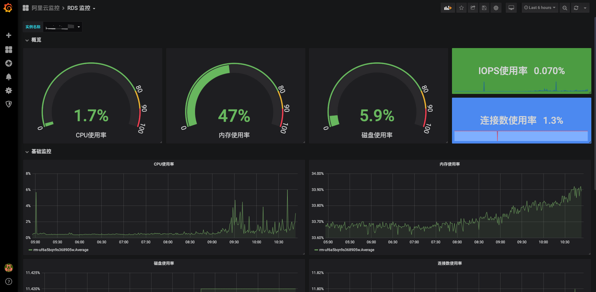
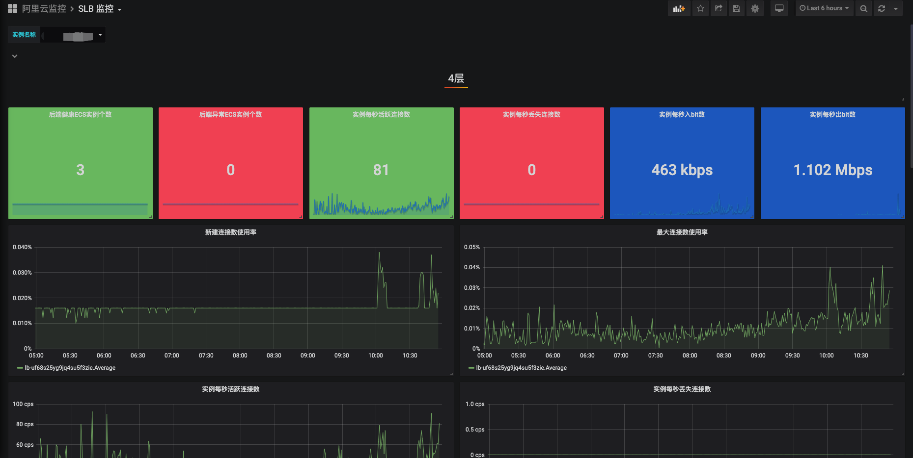
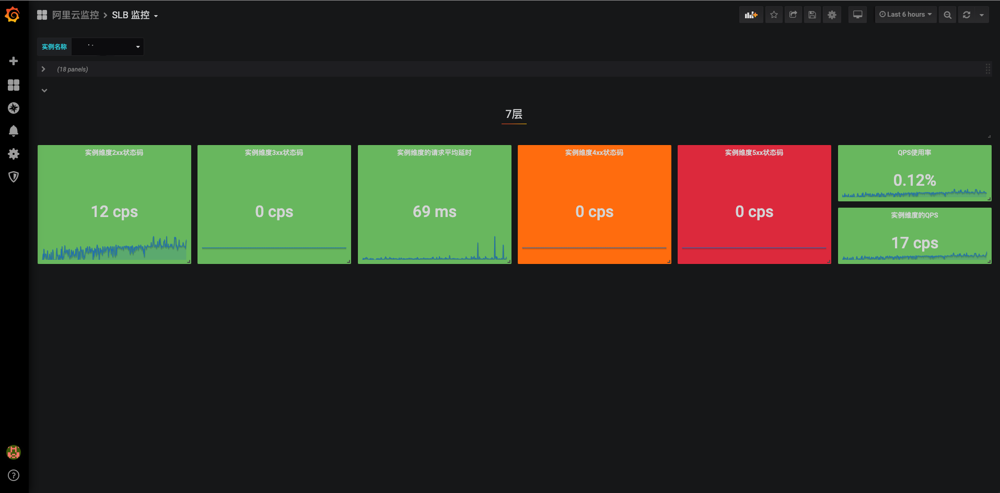
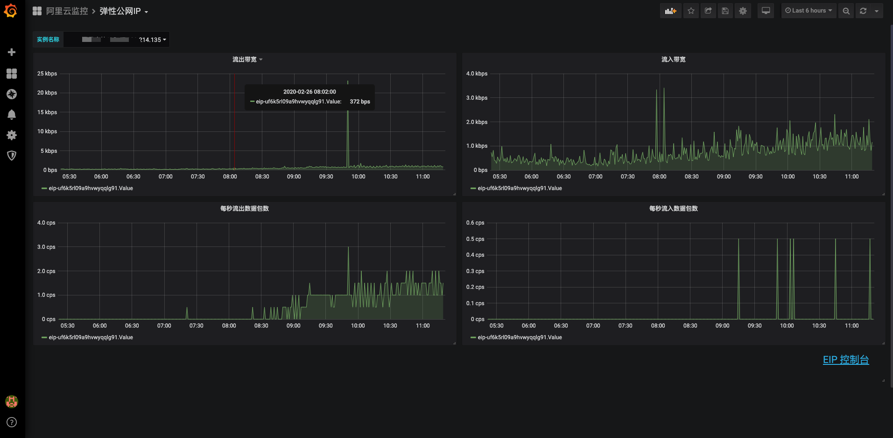
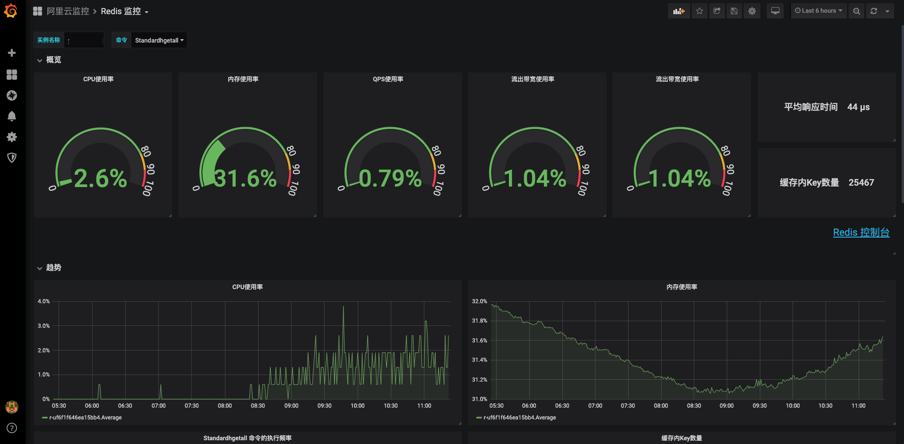

# cms-grafana-builder

English | [简体中文](README_CN.md)


The open-source platform for monitoring and observability.

## Introduction

This chart helps you run a grafana server that include aliyun cms dashboard.

## Quick Start

You can use the `docker` to experience the full functionality, with this should only be applied to local, production environments please use `helm`.

```bash
docker run -d -p 3000:3000 -e ACCESS_KEY_ID={your_access_key_id} -e ACCESS_SECRET={your_access_secret}  guoxudongdocker/grafana-cms-run:0.2.1-release
```

## Installing the Chart

### Helm v3

Download cms-grafana-0.3.0.tgz package to install in [release](https://github.com/sunny0826/cms-grafana-builder/releases).

To install the chart with the release name `my-release`:

```bash
# start
$ helm install my-release cms-grafana-0.3.0.tgz \
--namespace {your_namespace} \
--set access_key_id={your_access_key_id} \
--set access_secret={your_access_secret} \
--set region_id={your_aliyun_region_id} \
--set password={admin_password}

# set ingress and open tls
helm install my-release cms-grafana-0.3.0.tgz \
--namespace {your_namespace} \
--set access_key_id={your_access_key_id} \
--set access_secret={your_access_secret} \
--set region_id={your_aliyun_region_id} \
--set password={admin_password} \
--set ingress.enabled=true \
--set ingress.hosts[0].host="{your_host}",ingress.hosts[0].paths[0]="/" \
--set ingress.tls[0].secretName="{your_tls_secret_name}",ingress.tls[0].hosts[0]="{your_tls_host}"
```
__Please resolve the DNS to ingress.__

### Viewing the Grafnan dashboard

To do without ingress, you can use `kubectl port-forward`.

```bash
kubectl port-forward -n {your_namespace} deployment/my-release-cms-grafana 8080:8080 &
```

Visit http://localhost:8080 in your web browser.

## Uninstall

To uninstall/delete the `my-release` deployment:

```bash
$ helm uninstall my-release
```

## Configuration

The following table lists the configurable parameters of the kk-grafana-cms chart and their default values.

Parameter                 	 	| Description                        				| Default
------------------------------- | ------------------------------------------------- | ----------------------------------------------------------
`plugins`           	        | Grafana plugin list.         	            		| `farski-blendstat-panel,grafana-simple-json-datasource,https://github.com/sunny0826/aliyun-cms-grafana/archive/master.zip;aliyun-cms-grafana`
`access_key_id`                	| Aliyun Access Key Id.                  			| ``
`access_secret`                	| Aliyun Access Secret.                  			| ``
`region_id`                    	| Aliyun Region Id.                        			| `cn-shanghai`
`password`                    	| Grafana admin password.                  			| `admin`
`schedule`                    	| CronJob schedule.                     			| `"30 2 * * *"`
`image.repository`           	| Image source repository name.         			| `grafana/grafana`
`image.pullPolicy`         		| Image pull policy.                  				| `Always`
`build_image.repository`        | Build image source repository name.         	    | `guoxudongdocker/grafana-build`
`build_image.tag`              	| Image tag.                    		  	    	| `0.2.1-release`
`build_image.pullPolicy`       	| Image pull policy.                 				| `Always`
`backend_image.repository`      | Datasource image source repository name.          | `guoxudongdocker/grafana-build`
`backend_image.tag`             | Image tag.                        		    	| `0.2.1-release`
`backend_image.pullPolicy`      | Image pull policy.                         		| `Always`
`ingress.enabled`         		| Whether to open ingress.             				| `false`
`ingress.hosts`          		| Ingress hosts.                       				| `[]`

### Dashboard


### ECS


### RDS


### OSS


### SLB

**Layer 4**



**Layer 7**



### EIP


### Redis


